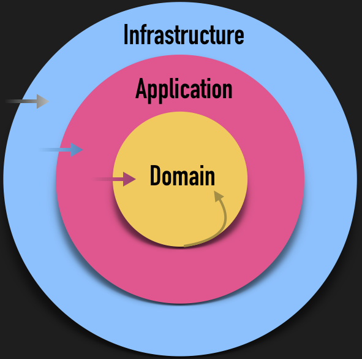
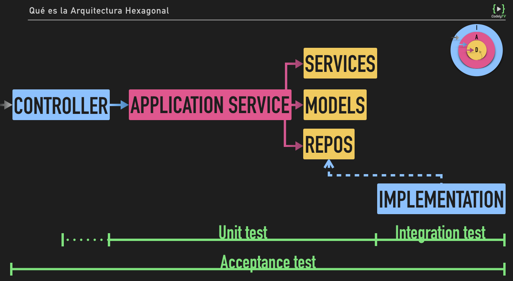

- [Capas de la Arquitectura Hexagonal](#capas-de-la-arquitectura-hexagonal)
  - [Dominio](#dominio)
  - [Aplicación](#aplicación)
  - [Infraestructura](#infraestructura)
- [Regla de dependencia](#regla-de-dependencia)
- [Puertos y adaptadores](#puertos-y-adaptadores)
- [Estructura de directorios](#estructura-de-directorios)
  - [Módulos o sub-dominios](#módulos-o-sub-dominios)
  - [Infraestructura compartida](#infraestructura-compartida)
  - [Bounded Contexts](#bounded-contexts)
- [servicios](#servicios)
  - [Servicios de infraestructura](#servicios-de-infraestructura)
  - [Servicios de Aplicación](#servicios-de-aplicación)
  - [Servicios de dominio](#servicios-de-dominio)
  - [Diferencias entre usar Servicios de Dominio y de Infraestructura desde Aplicación](#diferencias-entre-usar-servicios-de-dominio-y-de-infraestructura-desde-aplicación)
- [Value Objects](#value-objects)
- [Named Constructors en entidades y registro de eventos de dominio](#named-constructors-en-entidades-y-registro-de-eventos-de-dominio)
  - [Publicación de eventos de dominio](#publicación-de-eventos-de-dominio)
- [Testing](#testing)
  - [Tipos de tests](#tipos-de-tests)

# Capas de la Arquitectura Hexagonal



## Dominio

Conceptos que están en nuestro contexto (Usuario, Producto, Carrito, etc), y reglas de negocio que vienen determinadas en exclusiva por nosotros (servicios de dominio),

## Aplicación

La capa de aplicación es donde viven los casos de uso de nuestra aplicación (registrar usuario, publicar producto, añadir producto al carrito, etc).

## Infraestructura

Código que cambia en función de decisiones externas. En esta capa vivirán las implementaciones de las interfaces que definiremos a nivel de dominio. Es decir, nos apoyaremos en el DIP de SOLID para poder desacoplarnos de las dependencias externas.

# Regla de dependencia

Hay una regla de oro que deberemos tener en cuenta al tratar con código que respete una Arquitectura Hexagonal: La regla de dependencia.

Esta regla nos dice que el código que viva en cada una de nuestras capas sólo deberá conocer las clases que se ubican en la capa inmediatamente siguiente. Entendemos el orden de las capas desde fuera hacia dentro del círculo: Infraestructura -> Aplicación -> Dominio.

Esta regla lo que nos proporciona es la posibilidad de cambiar elementos de nuestras capas más externas sin que las internas se vean afectadas. Por esto adquiere más sentido que los aspectos que más variabilidad tienen ya que no dependen de nosotros estén en la capa más externa (infraestructura).

# Puertos y adaptadores

La Arquitectura Hexagonal también se denomina “Ports and adapters”. De hecho, en nuestra opinión este término es más acertado ya que tiene connotaciones más cercanas a lo que podríamos pensar al ver cómo queda el código, y no implica un número finito como sí lo hace la palabra hexágono.

En ese sentido, podemos pensar que:

- Los **puertos**: son las interfaces definidas en la capa de dominio para desacoplarnos de nuestra infraestructura. Ejemplo: UserRepository
- Los **adaptadores**: son las implementaciones posibles de esos puertos. Estas implementaciones traducirán esos contratos definidos en la interfaz a la lógica necesaria a ejecutar en base a un determinado proveedor. Ejemplo: MySqlUserRepository

# Estructura de directorios

dentro de cada módulo de nuestra aplicación (usuarios y vídeos) tenemos 3 carpetas, una para cada capa de nuestra arquitectura

```bash
$ tree -L 3
.
├── entry_point
│   ├── EntryPointDependencyContainer.scala
│   ├── Routes.scala
│   ├── ScalaHttpApi.scala
│   └── controller
│       ├── status
│       ├── user
│       └── video
└── module
    ├── shared
    │   └── infrastructure
    ├── user
    │   ├── application
    │   ├── domain
    │   └── infrastructure
    └── video
        ├── application
        ├── domain
        └── infrastructure
```

## Módulos o sub-dominios

Son agrupaciones de código en base a los conceptos principales de nuestra aplicación.

```bash
$ tree module/video
module/video
├── application
│   ├── create
│   │   └── VideoCreator.scala
│   └── search
│       └── VideosSearcher.scala
├── domain
│   ├── Video.scala
│   ├── VideoCategory.scala
│   ├── VideoDuration.scala
│   ├── VideoId.scala
│   ├── VideoRepository.scala
│   └── VideoTitle.scala
└── infrastructure
    ├── dependency_injection
    │   └── VideoModuleDependencyContainer.scala
    ├── marshaller
    │   └── VideoJsonFormatMarshaller.scala
    └── repository
        └── DoobieMySqlVideoRepository.scala
```

## Infraestructura compartida

Por ejemplo de la configuración de base de datos, conexión a ésta, y otras posibles cositas que tengamos. Lo que hacemos nosotros es ubicarla en un modulo “shared”:

```bash
$ tree module/shared/infrastructure
module/shared/infrastructure
├── config
│   └── DbConfig.scala
├── dependency_injection
│   └── SharedModuleDependencyContainer.scala
└── persistence
    └── doobie
        ├── DoobieDbConnection.scala
        └── TypesConversions.scala
```

## Bounded Contexts

Básicamente lo que establece este concepto es un nuevo nivel de separación en nuestro código. Es decir, de fuera hacia dentro nuestra aplicación tendrá N contextos donde cada uno de ellos tendrá N módulos.

Cabe destacar que a diferencia de los módulos, cada contexto tendrá su propia infraestructura. Para comunicarnos entre contextos usaremos el mismo método que para comunicarnos entre módulos: Commands o Queries a través del Bus correspondiente 🙂

La estructura de directorios que veríamos por tanto en este otro caso sería similar a:

```bash
$ tree src -L 5 -d // ℹ️ Output simplificando para ilustrar mejor el objeto de análisis de esta lección
src
├── Context
│   ├── Video
│   │    ├── Infrastructure
│   │    │   ├── Doctrine
│   │    │   └── Symfony
│   │    ├── Module
│   │    │   ├── Notification
│   │    │   │   ├── Application
│   │    │   │   ├── Domain
│   │    │   │   ├── Infrastructure
│   │    │   │   └── ...
│   │    │   └── ...
│   │    └── ...
│   └── ...
├── Infrastructure
│   ├── Bus
│   │   ├── Command
│   │   ├── Event
│   │   └── Query
│   └── ...
├── Shared
│   ├── Domain
│   │   └── Bus
│   │       ├── Command
│   │       ├── Event
│   │       └── Query
│   ├── Infrastructure
│   │   └── Persistence
│   │       └── Course
│   └── ...
└── ...
```

# servicios

## Servicios de infraestructura

Aspectos a tener en cuenta:

- Las particularidades de cada adaptador/implementación de nuestras interfaces las especificaremos a través de inyección vía constructor. Ejemplos:
  - Conexión con base de datos en repositorios
  - Sender y credenciales SMTP en servicio de notificación vía email
  - Canal y API Key en servicio de notificación vía Slack
- Evitaremos el acoplamiento estructural en nuestras interfaces no acoplando los contratos, lógica, o flujo de llamadas a conceptos relacionados con alguna de nuestras implementaciones.
- Usaremos implementaciones fake de servicios como el de envío de email para ejecutar nuestros tests.

#### Dominio compartido

A su vez, otro de los conceptos que compartiremos entre módulos serán nuestros pequeños Value Objects que modelan por ejemplo los identificadores de nuestras entidades.

Esto lo haremos ya que, por ejemplo, un Video podría contener el identificador del usuario que lo ha publicado. Con lo cuál, desde el momento en el que la forma de relacionar una entidad de un módulo con otra entidad de un módulo diferente es a través de este identificador y no una relación de asociación para evitar el acoplamiento, no nos queda otra que compartir el UserId entre los dos módulos.

## Servicios de Aplicación

- Son los puntos de entrada a nuestra aplicación. Es decir, como se ve en el gráfico, los controladores de línea de comandos o de nuestra API HTTP (¡como la del curso de Scala!) invocarán a los servicios de aplicación.
- Representan de forma atómica un caso de uso de nuestro sistema. En caso de modificaciones del estado de nuestra aplicación:
  - Podrán hacer las de barrera transaccional con el sistema de persistencia.
  - Publicarán los eventos de dominio respectivos.
- Coordinan las llamadas a los distintos elementos de nuestro sistema para ejecutar un determinado caso de uso.
- Les llamaremos indistintamente Servicio de Aplicación como caso de uso.

## Servicios de dominio

Los servicios de domino representan una agrupación de lógica de negocio que podremos reutilizar desde múltiples Servicios de Aplicación.

Vamos a poner un ejemplo para poder explicarnos mejor. Tenemos dos casos de uso en nuestra aplicación:

- Obtener un vídeo en base a su identificador
- Modificar el título de un determinado vídeo

En ambos casos de uso, necesitaremos la lógica de negocio para:

- Ir al repositorio de vídeos a buscar un vídeo determinado en base a su identificador
- Lanzar una excepción de dominio tipo VideoNotFound en caso de no encontrar el vídeo. Importante destacar que quien lanza esta excepción, como comentamos en el vídeo, no es la implementación del repositorio.
- Retornar el vídeo en caso de encontrarlo

Para evitar duplicar esta lógica de negocio en los 2 Servicios de Aplicación lo que solemos hacer es extraerla a un Servicio de Dominio que invocaremos desde ambos casos de uso.

Es importante destacar que los servicios de dominio **en ningún caso publicarán los eventos de dominio** que se puedan producir ni gestinonarán transacciones. Eso se lo dejamos al Application Service que nos invoca para evitar duplicidades ya que es realmente él quién establece la “atomicidad” del caso de uso.

## Diferencias entre usar Servicios de Dominio y de Infraestructura desde Aplicación

### Servicio de Aplicación -> Servicio de Infraestructura

Cuando interaccionamos con un servicio de infraestructura desde uno de aplicación, lo que hacemos como vimos en la lección anterior es hacer uso del Principio de Inversión de Dependencias.

Es decir, **el Servicio de Aplicación recibe por constructor el colaborador de infraestructura** que, para evitar acoplamiento, lo hace a través de una interface de dominio.

Esto es así para **aislarnos de los posibles cambios por terceros** en esas implementaciones, y poder **falsear esos colaboradores a la hora de ejecutar nuestros tests**. En test, en vez de inyectar el repositorio de MySQL, inyectaremos uno en memoria para que se ejecuten más rápido (por ejemplo).

### Servicio de Aplicación -> Servicio de Dominio

A la hora de invocar un Servicio de Dominio desde uno de Aplicación, nos encontramos una situación diferente y por lo tanto trataremos este caso de forma distinta.

Los servicios de dominio, por definición, sólo contendrán lógica de negocio. Con lo cuál, **no necesitaremos desacoplarnos de ellos** como sí necesitábamos desacoplarnos de los servicios de infraestructura.

Además, **al no tocar entrada/salida, tampoco nos interesará inyectar una implementación diferente** de nuestro servicio de dominio durante la ejecución de nuestros tests.

Es más, nos interesará que nuestros tests pasen por el servicio de dominio a la hora de testear el caso de uso para así poder cubrirlo de forma indirecta.

Con lo cuál, los servicios de dominio **no tendrán una interface por encima** ya que es totalmente innecesaria. No aportaría más que complejidad a través del nivel de indirección adicional que suponen en nuestro sistema.

Algo que es discutible es si la lógica de instanciación de ese Servicio de Dominio le pertenece al Servicio de Aplicación tal y como mostramos en el vídeo o, a pesar de no tener una interface por encima, lo inyectamos ya instanciado al Servicio de Aplicación. Esto lo dejamos al gusto del consumidor ya que cada alternativa tiene sus pros y sus contras como comentamos en el vídeo 🙂

# Value Objects

Los Value Objects (VO) u “Objetos de Valor”, no son más que clases que se identifican por el valor que representan.

Por ejemplo, cuando hablamos de nuestras entidades de dominio como puede ser Video, éstas tienen un atributo que será el identificador. Por lo tanto, si cambia el título del vídeo, seguimos entendiendo que se trata del mismo vídeo ya que tiene el mismo identificador.

En cambio, los conceptos de dominio que modelemos usando el patrón VO, serán elementos como por ejemplo la URL de los vídeos. Con lo cuál, si cambia su valor, ya no representará el mismo concepto. Por esto decimos que se identifican por el valor que contienen.

```php
// Extracto de: https://github.com/CodelyTV/cqrs-ddd-php-example/blob/master/src/Context/Video/Module/Video/Domain/VideoUrl.php
final class VideoUrl extends StringValueObject
{
    public function __construct(string $value)
    {
        $this->guardValidUrl($value); // ℹ️ Validación en el momento de instanciación. No permitimos tener un VideoUrl con un null por ejemplo.

        parent::__construct($value);
    }

    private function guardValidUrl(string $url)
    {
        if (false === filter_var($url, FILTER_VALIDATE_URL)) {
            throw new \InvalidArgumentException(sprintf('The url <%s> is not well formatted', $url));
        }
    }
}
```

# Named Constructors en entidades y registro de eventos de dominio

Básicamente es el patrón que usamos en la entidad `Video` para registrar el evento de dominio `VideoCreatedDomainEvent` a la hora de crear nuevos vídeos:

```php
// Extracto de: https://github.com/CodelyTV/cqrs-ddd-php-example/blob/master/src/Context/Video/Module/Video/Domain/Video.php

final class Video extends AggregateRoot
{
    private $id;
    private $title;
    private $url;
    private $courseId;

    // ℹ️ Constructor por defecto. Útil por ejemplo para recuperar instancias de videos en un determinado estado a través de la base de datos.
    public function __construct(VideoId $id, VideoTitle $title, VideoUrl $url, CourseId $courseId)
    {
        $this->id       = $id;
        $this->title    = $title;
        $this->url      = $url;
        $this->courseId = $courseId;
    }

    // ℹ️ Named constructor para instanciar nuevos vídeos que se creen por primera vez.
    public static function create(VideoId $id, VideoTitle $title, VideoUrl $url, CourseId $courseId): Video
    {
        $video = new self($id, $title, $url, $courseId); // ℹ️ Creamos la instancia a través del constructor por defecto.

        $video->record( // ℹ️ Nos guardamos en un array interno de la clase el evento de vídeo creado para publicarlo a posteriori desde el Application Service.
            new VideoCreatedDomainEvent(
                $id->value(),
                [
                    'title'    => $title->value(),
                    'url'      => $url->value(),
                    'courseId' => $courseId->value(),
                ]
            )
        );

        return $video; // ℹ️ Retornamos la instancia creada con el evento registrado.
    }
}
```

Destacar por tanto que siempre **registraremos los eventos de nuestras entidades en el punto donde se produzcan estas acciones.**

## Publicación de eventos de dominio

Para que otras aplicaciones de nuestro sistema lo puedan aprovechar, o incluso otros módulos de nuestra propia aplicación.

La publicación de eventos de dominio la podríamos hacer de múltiples formas:

- Con un singleton o método estático del publicador de eventos
- Inyectando el servicio de publicación de eventos en la entidad
- Inyectando el publicador de eventos en el caso de uso

  ```php
  // Extracto de: https://github.com/CodelyTV/cqrs-ddd-php-example/blob/master/src/Context/Video/Module/Video/Application/Create/VideoCreator.php
  final class VideoCreator // ℹ️ Servicio de Aplicación / Caso de uso de crear nuevo vídeo!
  {
      private $repository;
      private $publisher;

      public function __construct(VideoRepository $repository, DomainEventPublisher $publisher)
      {
          $this->repository = $repository;
          $this->publisher  = $publisher;
      }

      public function create(VideoId $id, VideoTitle $title, VideoUrl $url, CourseId $courseId)
      {
          $video = Video::create($id, $title, $url, $courseId); // ℹ️ Creamos el vídeo (¡Sólo registrando el evento, no publicándolo!)

          $this->repository->save($video); // ℹ️ Guardamos el vídeo en nuestro sistema de persistencia

          $this->publisher->publish(...$video->pullDomainEvents()); // ℹ️ Obtenemos los distintos eventos que se han podido registrar en la entidad, y los publicamos
      }
  }
  ```

# Testing



- Test unitarios: Capa de Aplicación y Dominio
- Test de integración: Capa de Infraestructura
- Test de Aceptación: Todas las capas

## Tipos de tests

### Test de aceptación

**Simulan ser un cliente de nuestra aplicación.** Entrarán en juego todas las implementaciones reales para comprobar que todo el flujo y la integración con la infraestructura se producen satisfactoriamente. Con lo cuál, las características principales serían:

- El objetivo de estos tests es el de **asegurar que la aplicación funciona correctamente** y el flujo completo de las peticiones se puede realizar satisfactoriamente.
- **Son los test más lentos** de ejecutar ya que tienen un alcance mayor y sí ejecutan operaciones de entrada/salida como inserts en base de datos ya que usan las implementaciones reales de estos componentes.
- **Aportan mayor valor** debido al alcance que tienen (nos asegura que absolutamente todo está ejecutandose como esperamos)
- En nuestro caso, al implementar una API HTTP, **simularemos peticiones HTTP** y comprobaremos que las respuestas tienen el código HTTP y el contenido del cuerpo esperados.
- Al ser los test más lentos de ejecutar, **sólo implementaremos una pequeña muestra de las distintas ramificaciones** que pueden tomar nuestros casos de uso. Dejando para los test unitarios la responsabilidad de probar cada una de las casuísticas. Así evitaremos incurrir en el anti-patrón de test del cono de helado.

Ejemplo: test de aceptación con Behat (Behat es un framework de testing para PHP que implementa Gherkin)

```
// Extracto de: https://github.com/CodelyTV/cqrs-ddd-php-example/blob/af67faf454e29b608d57ea3ca7156e2b25696512/applications/api/features/video/video_post.feature

Feature: Create video
  In order to be the best youtuber ever
  As a codelyver
  I want to create a video

  Scenario: Create an screencast video
    Given  I send a POST request to "/video" with body:
    """
    {
      "request_id": "170cfccd-869d-414b-a521-9cce9e0e67a2",
      "id": "465892a1-5a77-4cee-9450-46ecd6b68f69",
      "title": "Exprimiendo los tipos de PHP7",
      "url": "https://codely.tv/screencasts/tipos-php-7/",
      "type": "screencast",
      "course_id": "9c8a481a-0fe2-49cf-ab8a-79bcc2965d00"
    }
    """
    Then the response should be empty
    And the response status code should be 201
```

### Test unitarios

Los test unitarios son los que usaremos para comprobar que la lógica de negocio de nuestros casos de uso (capa de aplicación) y modelos o servicios de dominio se comportan como esperamos. Características principales:

- El objetivo de estos tests es el de **validar que la implementación de nuestra lógica de negocio es correcta.**
- **Son los test más rápidos de ejecutar.** En estos tests falsearemos la implementación a usar de todo componente de infraestructura. Es decir, allá donde definamos un puerto en nuestros casos de uso, inyectaremos un doble de test para que no hagan operaciones de entrada/salida pero poder validar la interacción del dominio con estos componentes. Importante falsear la interface de dominio y no el cliente final para evitar incurrir en el anti-patrón de Infrastructure Mocking.
- **El test unitario será independiente del punto de entrada.** Desde el momento en el que encapsulamos nuestros casos de uso en servicios de aplicación para poderlos reaprovechar desde múltiples puntos de entrada (controlador API HTTP o CLI), el test unitario invocará directamente al caso de uso para desacoplarse también del controlador.
- Al ser los más rápidos de ejecutar y estar centrados en la lógica de negocio, es en estos test donde ubicamos las **comprobaciones más exhaustivas** en cuanto a las distintas ramificaciones de nuestros casos de uso.

Ejemplo: test del caso de uso de crear vídeo en el repo del curso de API HTTP en Scala

```scala
// Extracto de: https://github.com/CodelyTV/scala-http-api/blob/59b9d3281a904f01e483e5b7aa1c0af49df069f8/src/test/tv/codely/scala_http_api/module/video/application/create/VideoCreatorShould.scala
// Simplificando herencia con: https://github.com/CodelyTV/scala-http-api/blob/59b9d3281a904f01e483e5b7aa1c0af49df069f8/src/test/tv/codely/scala_http_api/module/video/infrastructure/repository/VideoRepositoryMock.scala y https://github.com/CodelyTV/scala-http-api/blob/59b9d3281a904f01e483e5b7aa1c0af49df069f8/src/test/tv/codely/scala_http_api/module/shared/infrastructure/MessagePublisherMock.scala

final class VideoCreatorShould extends UnitTestCase with MockFactory {

  // ℹ️ Falseamos las dependencias de infraestructura (adapters) creando un doble de test de la interface de dominio (ports)
  private val repository: VideoRepository = mock[VideoRepository]
  private val messagePublisher: MessagePublisher = mock[MessagePublisher]

  // ℹ️ Instanciamos el caso de uso inyectando las dependencias falseadas
  private val creator = new VideoCreator(repository, messagePublisher)

  "create a video" in {
    val video        = VideoStub.random
    val videoCreated = VideoCreatedStub(video)

    // ℹ️ Definimos la comprobación de que el caso de uso interacciona con el repositorio guardando nuestro vídeo
    repositoryShouldSave(video)

    // ℹ️ Definimos la comprobación de que el caso de uso interacciona con el publicador de eventos publicando el evento de vídeo creado
    publisherShouldPublish(videoCreated)

    // ℹ️ Invocamos al caso de uso directamente sin pasar por la capa del controlador y esperamos que se ejecute satisfactoriamente y con las interacciones previamente definidas
    creator.create(video.id, video.title, video.duration, video.category).shouldBe(())
  }

  private def repositoryShouldSave(video: Video): Unit =
    (repository.save _)
      .expects(video)
      .returning(Future.unit)

  private def publisherShouldPublish(message: Message): Unit =
    (messagePublisher.publish _)
      .expects(message)
      .returning(())
}
```

### Test de integración

Estos serían un tipo de test unitario donde **el objeto de test es alguna implementación de uno de nuestros puertos.**

Es decir, en el caso del test unitario, habríamos falseado mediante un doble de test la interface de dominio `UserRepository`, mientras que en el test de integración lo que haremos será justamente testear la implementación de `MySqlUserRepository` para validar que se comporta como esperamos.
